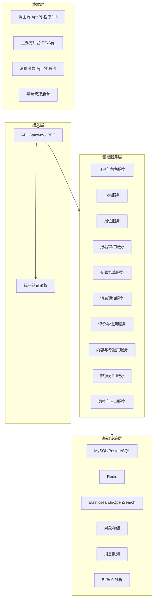
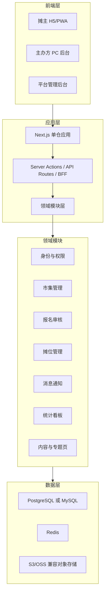
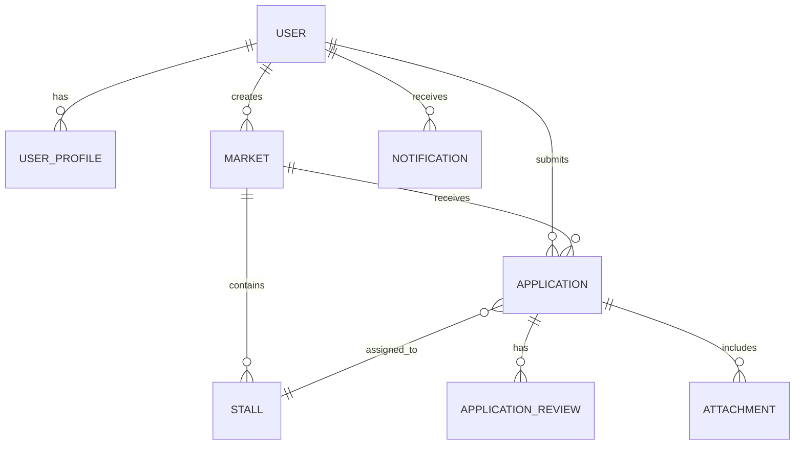
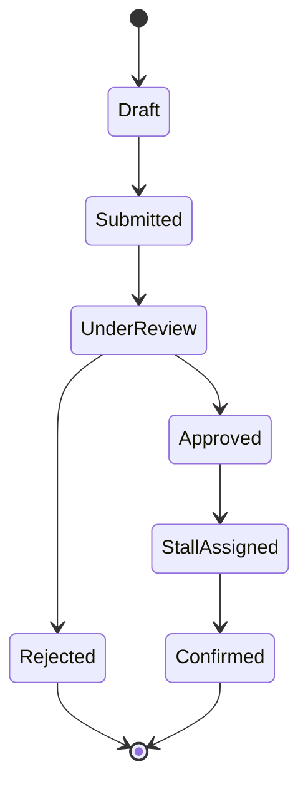
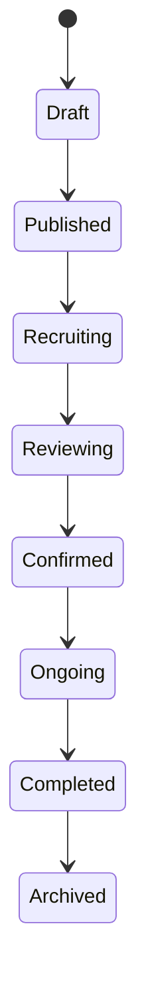
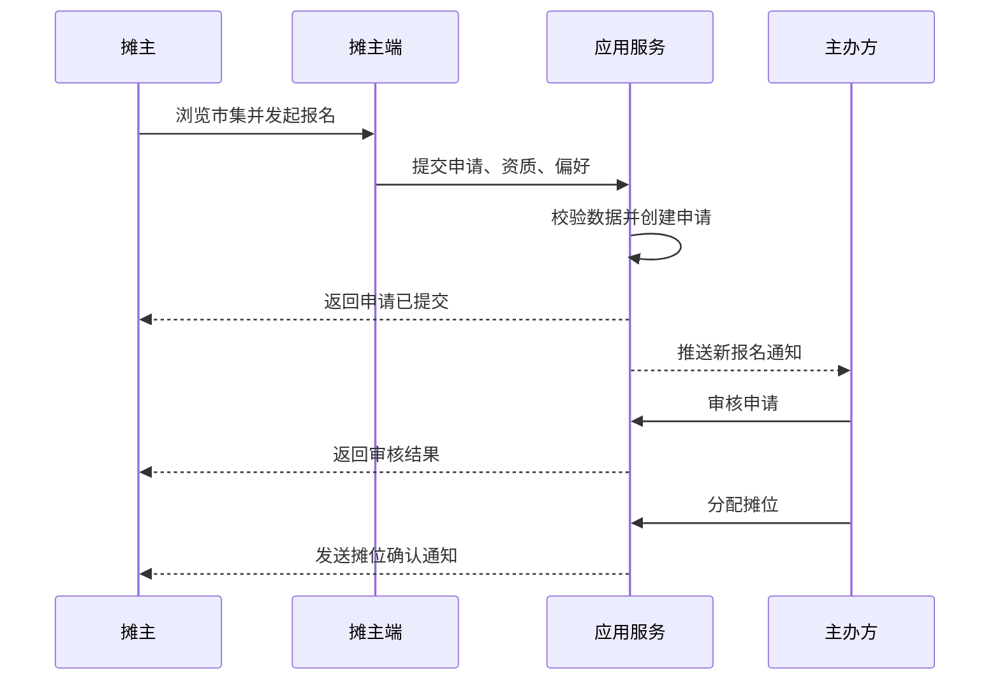
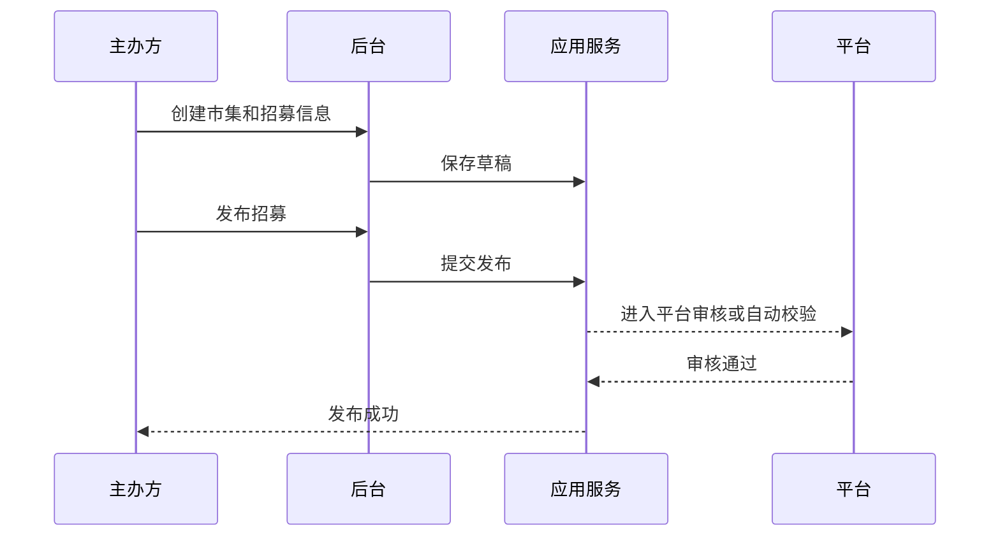
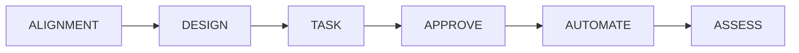
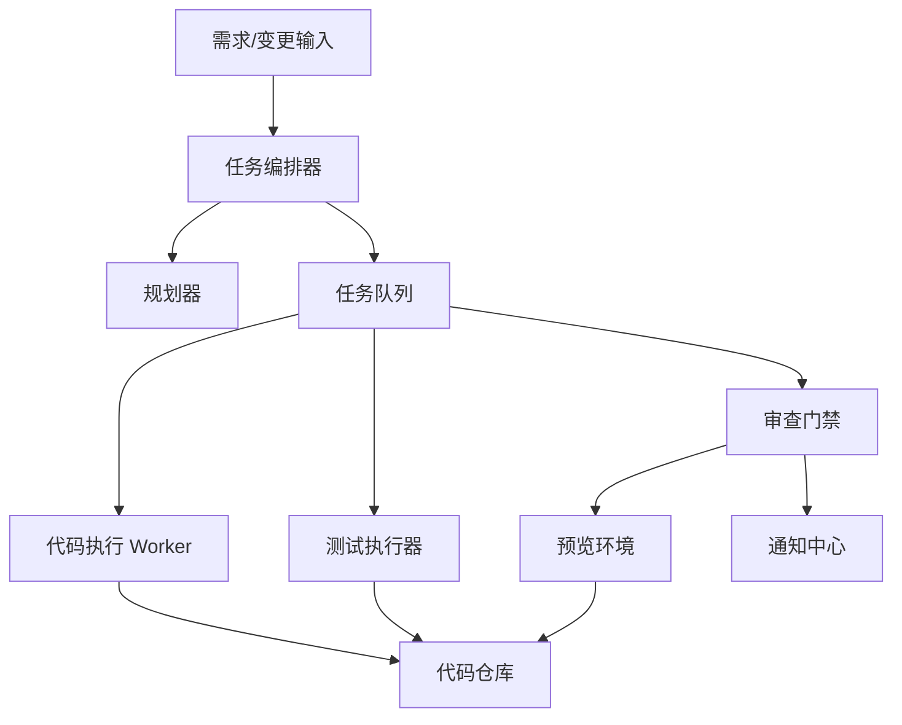

# DESIGN: 市集招募平台

## 1. 文档信息

- 项目名称：市集招募平台
- 文档阶段：Architect
- 文档日期：2026-05-01
- 设计策略：双轨设计
- 设计目标：同时覆盖“终局产品架构”和“可自动开发的 MVP 落地架构”

## 2. 设计原则

- 组件化与复用优先
- 响应式优先，先支持 PC 与移动 Web/PWA
- 统一领域模型优先于终端数量
- 安全、可审计、可回滚优先于完全自动化
- 先单仓模块化，再按负载与组织边界拆服务
- 任何自动化执行都必须经过门禁与验收

## 3. 总体架构概览

## 3.1 双轨架构说明

- 终局轨：面向多角色、全端、服务化、生态化
- MVP 轨：面向快速闭环验证、云端自动研发、统一技术栈

## 3.2 终局逻辑架构

## 3.3 MVP 落地架构

## 4. 技术选型

## 4.1 终局轨建议

- 移动多端：Kuikly 或 Lynx 作为重点预研对象
- PC 管理台：React/Next.js
- 后端：服务化架构，可选 Spring Cloud 或 Node/NestJS 服务化
- 部署：Kubernetes，多环境隔离
- 数据：关系型数据库 + Redis + 搜索引擎 + 对象存储 + 消息队列

## 4.2 MVP 轨建议

- 前端：Next.js + TypeScript + Tailwind CSS
- UI：组件化设计系统，优先 Headless + Tailwind 组合
- 后端：Next.js API Routes 或 Route Handlers + 领域服务层
- 数据库：PostgreSQL 优先，MySQL 可替换
- 缓存：Redis
- 文件：S3/OSS 兼容存储
- 鉴权：JWT + Session 混合策略
- 部署：Vercel/容器平台均可，推荐先单区部署

## 4.3 选型理由

- 统一 TypeScript 栈更适合 Agent 自动开发
- 单仓模块化更容易做代码检索、批量修改和自动测试
- PWA/H5 可最快覆盖手机使用场景
- 后续若需原生化，可复用接口、领域模型、设计系统和大部分业务逻辑

## 5. 角色与端能力规划

## 5.1 摊主端

MVP 能力：

- 注册登录
- 浏览与筛选市集
- 查看市集详情
- 填报报名申请
- 上传基础资质与商品图
- 查看审核状态与通知

终局扩展：

- 收藏与推荐
- 经营工具
- 财务与提现
- 信用分
- 线上商城
- 学堂与社群

## 5.2 主办方端

MVP 能力：

- 创建市集
- 管理招募信息
- 查看报名列表
- 审核摊主
- 配置摊位
- 分配摊位
- 查看基础看板

终局扩展：

- 智能筛选
- OCR 审核
- 可视化摊位地图
- 财务结算
- 协同宣传
- 活动执行管理

## 5.3 平台管理端

MVP 能力：

- 用户管理
- 内容审核
- 市集审核
- 简单投诉处理

终局扩展：

- 风控策略
- 商业化配置
- 数据资产管理
- 信用体系管理

## 6. 领域模型设计

## 6.1 核心实体

- User：用户
- UserProfile：角色资料
- OrganizerProfile：主办方资料
- VendorProfile：摊主资料
- Market：市集
- MarketSchedule：市集时间段
- Stall：摊位
- Application：报名申请
- ApplicationReview：审核记录
- Notification：站内通知
- Attachment：资质与图集文件
- DashboardSnapshot：统计快照

## 6.2 核心关系

## 6.3 状态机

### 报名申请状态

### 市集状态

## 7. 关键业务流程

## 7.1 摊主报名流程

## 7.2 主办方发招募流程

## 8. 模块划分

## 8.1 前端模块

- `apps/web-vendor`：摊主侧页面或摊主专区
- `apps/web-organizer`：主办方后台
- `apps/web-admin`：平台后台
- `packages/ui`：通用组件
- `packages/domain`：共享类型与领域模型
- `packages/config`：ESLint、TypeScript、Tailwind 等共享配置

## 8.2 后端模块

- `auth`：用户登录、注册、鉴权、角色
- `market`：市集、时间、地点、招募配置
- `stall`：摊位、区域、状态、分配
- `application`：申请、审核、状态机、附件
- `notification`：站内信、邮件/短信网关抽象
- `dashboard`：核心指标聚合
- `cms`：专题页和内容块
- `admin`：平台审核、治理操作

## 9. 接口边界设计

## 9.1 API 风格

- RESTful 为主
- 复杂统计可使用聚合查询接口
- 所有接口统一版本前缀：`/api/v1`
- 错误响应结构统一：`code`、`message`、`details`、`requestId`

## 9.2 核心接口族

- `POST /api/v1/auth/login`
- `POST /api/v1/markets`
- `GET /api/v1/markets`
- `GET /api/v1/markets/{id}`
- `POST /api/v1/applications`
- `GET /api/v1/applications`
- `PUT /api/v1/applications/{id}/review`
- `PUT /api/v1/stalls/{id}/assign`
- `GET /api/v1/dashboard/markets/{id}`

## 10. 数据流设计

## 10.1 业务数据流

1. 主办方创建市集
2. 系统发布到摊主可见列表
3. 摊主提交申请
4. 系统记录附件与状态
5. 主办方审核并分配摊位
6. 系统发送通知
7. 看板聚合招募数据用于复盘

## 10.2 分析数据流

1. 前端埋点记录页面访问、点击、提交
2. 后端记录业务事件
3. 定时任务生成日报与市场级看板快照
4. 后续用于推荐、信用与效果预测

## 11. 异常处理策略

- 表单校验失败：前端即时提示，后端返回字段级错误
- 附件上传失败：保留表单状态，支持重试
- 审核并发冲突：使用状态版本号或乐观锁
- 摊位重复分配：数据库唯一约束 + 服务层防重
- 通知失败：写入重试队列并告警
- 后台误操作：关键动作二次确认并保留审计日志

## 12. 安全设计

- 统一认证与权限控制
- 敏感配置使用环境变量与密钥管理
- 文件上传类型、大小、病毒与扩展名校验
- 所有审核与分配操作保留审计日志
- 重要接口加限流、防刷和幂等控制
- 用户隐私数据最小化收集与脱敏展示

## 13. 自动研发系统设计

## 13.1 文档驱动型自动研发流程

每个阶段要求：

- ALIGNMENT：明确范围、非目标、验收标准
- DESIGN：明确架构、数据流、接口边界、异常处理
- TASK：拆原子任务，定义输入输出契约
- APPROVE：人工确认，不允许任务边界漂移
- AUTOMATE：AI/Agent 执行编码、测试、文档同步
- ASSESS：交付验收、发布总结、遗留清单

## 13.2 调度系统型自动研发平台

### 核心组件

- 任务编排器：读取需求、拆分任务、维护依赖图
- 规划器：把设计文档映射为原子任务
- Worker：执行代码编辑、迁移、配置、脚本
- Test Runner：运行单元、集成、端到端检查
- Review Gate：检查风险、测试、规范和人工审批状态
- Preview：生成临时环境供验收
- Notification：回传进度、失败、阻塞、待确认事项

### 自动化门禁

- 涉及支付、鉴权、删除、迁移、外部生产资源的任务必须人工审批
- 任一任务测试失败必须停止下游依赖任务
- 批量修改超过阈值时必须先生成变更预览
- 任何自动生成代码必须附带验证命令

## 14. 部署设计

## 14.1 MVP 部署

- 应用：单仓 Web 应用
- 数据库：单实例 PostgreSQL/MySQL
- 缓存：单实例 Redis
- 对象存储：云 OSS/S3
- 环境：dev / staging / prod

## 14.2 终局部署

- 服务拆分部署到 Kubernetes
- 采用网关、配置中心、日志中心、消息队列
- 核心服务独立伸缩
- 多环境与多区域发布策略

## 15. 可扩展性设计

- 用领域模块替代过早微服务
- 以事件模型为未来异步化预留接口
- 所有 ID、状态机、通知模板统一抽象
- 数据埋点从 MVP 开始统一口径
- 把跨端问题延后到业务模型稳定之后处理

## 16. 架构验收标准

当以下条件满足时，Architect 阶段通过：

1. 终局轨和 MVP 轨均有完整架构说明
2. 核心角色、模块、数据流、状态机已定义
3. 自动研发流程和调度系统已定义
4. 安全、异常、部署、扩展性已有落位
5. TASK 阶段可基于本设计独立拆解
