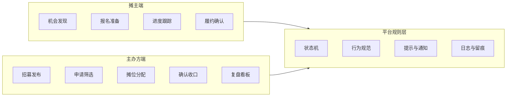
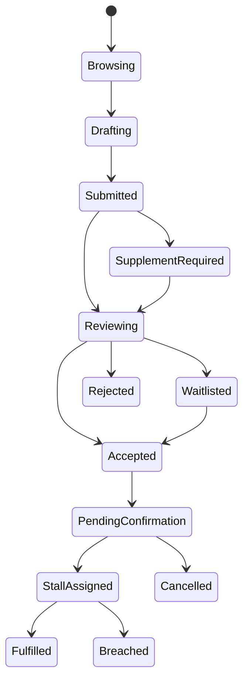
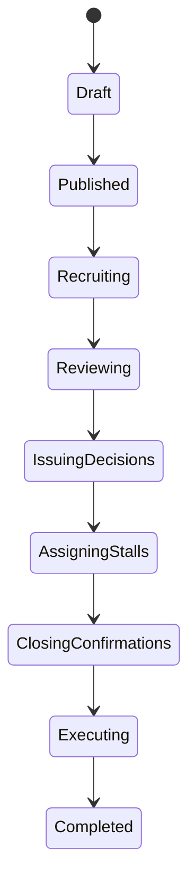

# DESIGN: 角色玩法升级

## 1. 文档信息

- 项目名称：市集招募平台
- 文档阶段：Architect
- 文档日期：2026-05-03
- 设计主题：摊主与主办方双角色玩法升级
- 设计目标：把双角色从“菜单差异”升级为“目标、行为、页面、规则”全面差异化的产品体系

## 2. 设计原则

- 成交闭环优先于内容展示
- 角色目标优先于功能平铺
- 状态透明优先于黑箱流转
- 行为规范优先于纯交互包装
- 强约束和柔性引导分层
- 复用现有认证与角色体系，不额外引入新的账号模型

## 3. 角色架构

## 4. 摊主端设计

### 4.1 产品定位

- 机会获取与报名进度产品
- 目标是减少判断成本和重复劳动
- 页面语义围绕“值不值得报、现在到哪、接下来做什么”

### 4.2 信息架构

- 首页
  - 适合我的招募
  - 待处理事项
  - 我的报名进度
  - 安全与履约提示
- 市集列表页
  - 城市
  - 日期
  - 品类
  - 客流预期
  - 摊位费用
  - 主办方信誉
- 市集详情页
  - 决策信息摘要
  - 招募规则
  - 品类适配说明
  - 报名入口
- 报名页
  - 通用资料
  - 本场补充问题
  - 风险提示
- 我的报名页
  - 已提交
  - 待补件
  - 审核中
  - 候补中
  - 已录取
  - 待确认
  - 已完成

### 4.3 核心交互策略

- 市集卡片优先显示关键决策信息，而不是长篇介绍
- 报名表单复用通用资料，减少重复填写
- 每条报名记录都必须有明确下一步动作
- 摊主视角中的状态说明必须面向“我接下来做什么”

## 5. 主办方端设计

### 5.1 产品定位

- 招商运营控制台
- 目标是减少审核堆积、错配和成场风险
- 页面语义围绕“哪里堵塞、哪里有风险、哪批人先处理”

### 5.2 信息架构

- 工作台首页
  - 招募进度总览
  - 待审核申请
  - 风险提醒
  - 待确认摊主
  - 空置风险
- 市集管理页
  - 草稿
  - 已发布
  - 招募中
  - 确认中
  - 已完成
- 申请池
  - 按匹配度排序
  - 按资料完整度排序
  - 按履约记录排序
  - 批量通过/拒绝/候补/补件
- 审核详情页
  - 摊主资料
  - 资质与图片
  - 历史履约
  - 操作记录
  - 结构化处理动作
- 摊位分配页
  - 未分配
  - 已分配
  - 冲突预警
  - 候补补位
- 复盘页
  - 报名数
  - 审核时效
  - 确认率
  - 空置率
  - 投诉与违约记录

### 5.3 核心交互策略

- 首页必须先显示堵点和风险，而不是静态统计
- 审核页强调快速决策和结构化原因
- 分配页强调结果控制，而不是单纯表格编辑
- 已录取后的变更必须显式留痕并通知

## 6. 双角色状态机

### 6.1 摊主状态机

### 6.2 主办方状态机

## 7. 规则引擎设计

### 7.1 强约束规则

- 报名截止后不可再提交
- 补件超时自动失效或降级
- 录取确认超时自动释放名额
- 状态不得跨级跳转
- 主办方必须留痕关键审核与分配动作
- 摊主不能操作审核和分配动作

### 7.2 柔性引导规则

- 资料完整度影响排序
- 历史履约影响优先级
- 报名时根据适配度给予提示
- 主办方审核超时先提醒，再进入信誉影响
- 对高质量行为提供标签和优先推荐

## 8. 冲突处理机制

### 8.1 处理时效冲突

- 摊主需要预期结果时间
- 主办方需要保留审核空间
- 方案：设置承诺时效、前台展示预计结果时间、后台展示催办提醒

### 8.2 海投与无效申请冲突

- 摊主会倾向多报
- 主办方需要高质量申请池
- 方案：低匹配报名提醒、主办方按适配度排序、资料完整度前置展示

### 8.3 透明与裁量冲突

- 摊主要原因
- 主办方要效率
- 方案：提供结构化拒绝和补件原因模板

### 8.4 占坑与空场冲突

- 摊主可能先拿名额再决定
- 主办方害怕空摊
- 方案：确认时限、候补补位、违约记录

## 9. 页面玩法差异化

### 9.1 摊主端页面风格

- 卡片流
- 移动优先
- 任务导向
- 状态和时限前置

### 9.2 主办方端页面风格

- 控制台
- 桌面优先
- 列表和工作区并重
- 风险和待处理前置

### 9.3 同对象不同语义

- 市集详情
  - 摊主：值不值得报
  - 主办方：招募效果如何
- 审核中
  - 摊主：我还要等多久
  - 主办方：还有多少库存未处理
- 摊位分配
  - 摊主：我被安排在哪
  - 主办方：怎么降低冲突和空位

## 10. 测试与验收建议

- 页面层
  - 摊主首页是否优先显示机会和进度
  - 主办方首页是否优先显示待处理和风险
- 状态层
  - 双角色状态文案是否语义清晰
  - 超时与补件逻辑是否一致
- 规则层
  - 强约束是否真的阻止非法流转
  - 柔性引导是否能在 UI 上被看见
- 日志层
  - 审核、录取、分配、确认、取消是否都有留痕

## 11. 设计结论

本轮设计不是简单地把同一功能拆成两个入口，而是为同一成交闭环定义两套不同的产品语义：

- 摊主端围绕 `机会和进度`
- 主办方端围绕 `运营和控制`
- 平台规则层围绕 `高质量成交`
