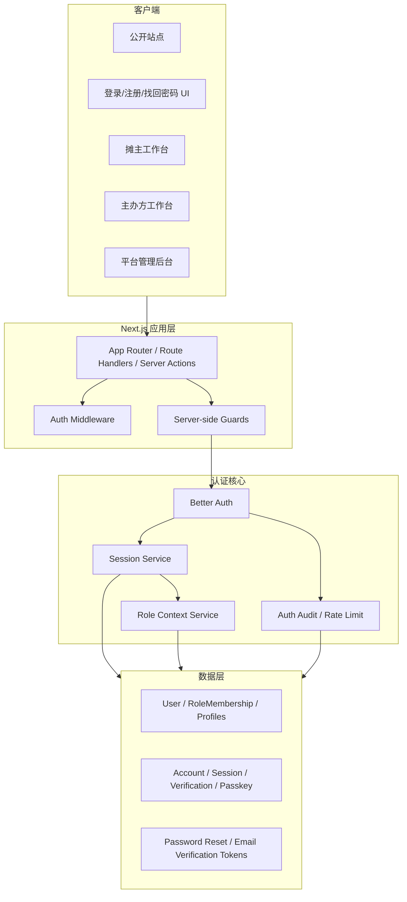
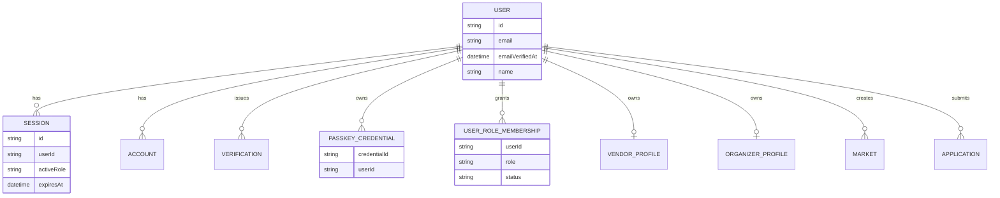
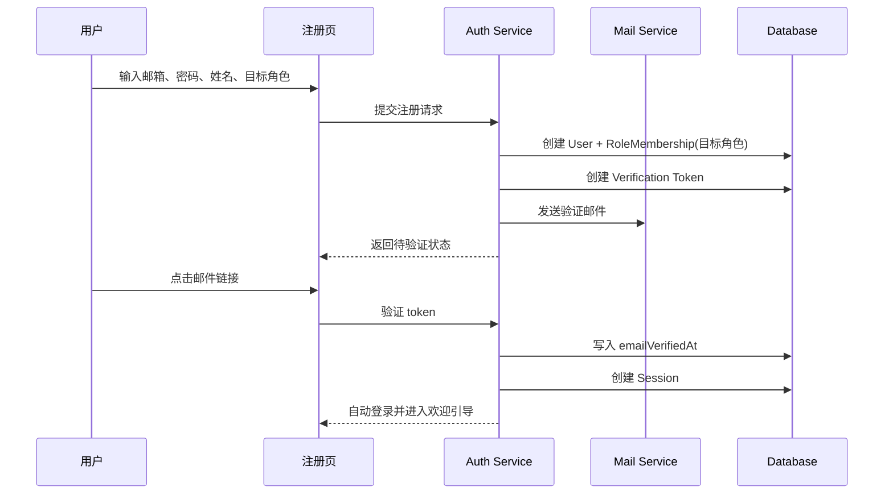

# DESIGN: 认证升级

## 1. 文档信息

- 项目名称：市集招募平台
- 文档阶段：Architect
- 文档日期：2026-05-03
- 设计目标：构建支持邮箱密码、Passkey、多角色能力和正式路由保护的现代认证架构
- 设计策略：以 `Better Auth + Prisma + WebAuthn` 为核心，在现有 Next.js 单仓内完成认证系统重构

## 2. 设计原则

- 统一账号优先于单角色便捷实现
- 服务端鉴权优先于前端信任
- 数据库会话优先于自签轻量 JWT
- 安全、审计、可恢复优先于实现捷径
- 兼容迁移优先于一次性硬切换
- 认证域与业务域解耦，但用户主实体保持一致

## 3. 总体架构概览

认证升级后，系统分为 4 个层次：

- 认证接入层：注册、登录、邮箱验证、Passkey、重置密码、登出
- 认证核心层：会话、账户、验证令牌、Passkey 凭证、限流、审计
- 授权与角色层：角色成员关系、当前上下文角色、权限检查、路由守卫
- 业务消费层：摊主端、主办方端、平台端 API 与页面复用统一身份上下文

## 4. 逻辑架构

## 5. 模块划分

### 5.1 认证接入模块

职责：

- 注册表单
- 登录表单
- Passkey 绑定与登录入口
- 邮箱验证页
- 忘记密码与重置密码页
- 会话与设备管理页

约束：

- 页面只负责交互与状态展示，不直接拼接权限规则
- 所有敏感操作都走服务端 Action 或 Route Handler

### 5.2 认证核心模块

职责：

- 创建账号、校验密码、签发会话
- 管理验证令牌、Passkey 凭证和会话撤销
- 统一输出当前认证用户和上下文
- 提供登录失败限流和审计扩展点

### 5.3 授权与角色模块

职责：

- 维护账号与角色成员关系
- 决定用户当前 active role
- 为页面、API、Server Actions 提供统一鉴权入口
- 拒绝匿名访问与未授权角色访问

### 5.4 业务适配模块

职责：

- 将现有 `vendor`、`organizer`、`admin` 业务逻辑迁移到新角色上下文
- 保证 `Market`、`Application` 等领域表继续以统一 `userId` 作为 actor 主键
- 在不破坏业务模型的前提下移除对旧 `User.role` 的硬依赖

## 6. 数据模型设计

### 6.1 核心实体

- `User`
  - 主账号实体
  - 关键字段：`id`、`email`、`emailVerifiedAt`、`name`、`avatarUrl`、`phone?`、`createdAt`、`updatedAt`
- `Account`
  - 外部账户或本地凭证映射
  - 首版主要承载邮箱密码凭证，后续可扩展 OAuth
- `Session`
  - 数据库会话
  - 关键字段：`id`、`userId`、`expiresAt`、`ipAddress`、`userAgent`、`activeRole`
- `Verification`
  - 邮箱验证、重置密码等一次性令牌
- `PasskeyCredential`
  - WebAuthn 凭证
  - 关键字段：`credentialId`、`publicKey`、`counter`、`transports`
- `UserRoleMembership`
  - 用户角色成员关系
  - 关键字段：`userId`、`role`、`status`、`grantedAt`
- `VendorProfile`
  - 摊主资料
- `OrganizerProfile`
  - 主办方资料
- `AdminAssignment`
  - 管理员授予记录，仅后台维护

### 6.2 与现有模型的迁移原则

- 现有 `User.phone` 从“必填唯一登录标识”降级为可选联系字段
- 现有 `User.role` 拆分为 `UserRoleMembership`，不再作为唯一角色来源
- 现有 `User.isVerified` 演进为 `emailVerifiedAt` 和角色/资料状态的组合语义
- 业务表 `Market.organizerId`、`Application.vendorId` 等继续关联 `User.id`
- 现有 demo 登录 alias 仅作为开发环境兼容层，不进入正式认证主链路

### 6.3 ER 关系

## 7. 认证流程设计

### 7.1 注册流程

规则：

- 注册时允许选择 `vendor` 或 `organizer` 作为首个业务角色
- 若用户后续需要另一个角色，在站内补开通而不是新建账号
- 管理员角色不能从公开注册入口获得

### 7.2 登录流程

- 密码登录：邮箱 + 密码 -> 服务端校验 -> 创建数据库会话 -> 落 Cookie
- Passkey 登录：通过 WebAuthn Assertion 完成强认证 -> 创建数据库会话
- 已绑定 Passkey 的用户在密码登录成功后展示“绑定/优先使用 Passkey”引导

### 7.3 忘记密码流程

- 用户输入邮箱
- 系统发送一次性重置链接
- 重置链接校验通过后允许设置新密码
- 密码重置成功后撤销旧会话或至少提示手动退出其他设备

### 7.4 角色开通与切换

- 首次注册时创建 1 条角色成员关系
- 已登录用户可从账号中心开通第二角色
- 会话中存储 `activeRole`，用于 UI 导航与默认落地页
- 服务端授权总是基于“角色成员关系 + activeRole + 业务资源归属”联合判断

## 8. 路由与授权设计

### 8.1 路由分类

- 公开路由：`/`、`/markets`、`/markets/[id]`、`/login`、`/register`、`/verify-email`、`/forgot-password`、`/reset-password`
- 登录必需路由：账号中心、申请报名、个人设置、通知中心
- 角色受限路由：`/organizer/**`、`/admin/**`

### 8.2 守卫策略

- 中间件负责第一层拦截：匿名访问受限路由时重定向到登录页，并带上 `returnTo`
- 服务端页面和 API 负责第二层鉴权：只信任服务端会话，不信任 query/body 中的身份注入
- 页面级根据 `activeRole` 和成员关系做体验引导，不承担最终安全判定

### 8.3 ISSUE-006 处理原则

当前匿名用户可进入主办方工作区的问题，必须通过新的统一守卫体系修复：

- 未登录访问 `/organizer/**` 一律跳转到登录页
- 已登录但无 `organizer` 成员关系的用户不得进入主办方路由
- 已登录但缺少必要资料时进入 onboarding，而不是直接放行核心工作台

## 9. 会话与安全设计

- Cookie 采用 `httpOnly`、`secure`、`sameSite=lax`
- 会话存储于数据库，支持多设备查看与撤销
- 密码哈希采用 `Argon2id`
- 邮件验证、重置密码令牌均为短期单次使用
- 认证入口增加基础限流：按 IP、邮箱、设备维度留扩展位
- 审计记录至少覆盖：注册、验证、登录成功、登录失败、重置密码、Passkey 绑定/删除、角色开通

## 10. 前端体验设计

### 10.1 登录页

- 双 Tab 或双主按钮：`密码登录`、`Passkey 登录`
- 支持 `returnTo` 回跳
- 明确错误提示：邮箱未验证、密码错误、账号不存在、服务暂不可用
- 去掉演示账号输入框作为正式默认入口

### 10.2 注册页

- 字段：姓名、邮箱、密码、目标角色
- 密码强度实时提示
- 提交后进入“请验证邮箱”状态页

### 10.3 账号中心

- 查看当前角色与可用角色
- 开通第二角色
- 绑定/移除 Passkey
- 查看当前设备会话并手动退出

## 11. 异常处理策略

- 注册冲突：邮箱已存在 -> 返回明确表单错误，不泄露更多账户信息
- 验证令牌失效：引导重发验证邮件
- Passkey 失败：允许退回密码登录
- 数据库或邮件服务异常：返回友好错误页或表单级错误，不暴露堆栈
- 角色不足：返回 `403` 页面或重定向到合适工作台，不回落到无保护状态

## 12. 测试设计

- 单元测试：密码策略、角色守卫、会话解析、令牌消费、迁移适配器
- 集成测试：注册、验证、登录、登出、忘记密码、重置密码、角色切换
- 页面测试：登录页、注册页、验证状态页、账号中心
- 中间件测试：匿名阻断、角色阻断、`returnTo` 回跳
- 浏览器验证：密码登录、Passkey 登录、主办方直注册、匿名访问受限路由

## 13. 迁移策略

### 13.1 阶段化迁移

1. 引入新认证表与兼容配置，不切旧登录入口
2. 建立正式注册、登录、重置密码、邮箱验证能力
3. 引入角色成员关系与新守卫，迁移页面和 API 到统一授权入口
4. 将旧演示登录降级为仅开发环境可见
5. 清理过期的 `User.role` 直接依赖与 demo alias 流程

### 13.2 兼容策略

- 旧用户可通过迁移脚本补齐邮箱或转换为受控测试账号
- 对无法自动迁移的开发数据，允许在 seed 阶段重建
- 保留环境开关 `AUTH_ENABLE_DEMO_LOGIN`，默认生产关闭

## 14. 架构验收标准

1. 新认证架构能够覆盖注册、登录、验证、找回密码、Passkey、会话管理
2. 多角色能力和业务域 `userId` 关系不冲突
3. 路由保护与服务端授权边界统一
4. 迁移策略能兼容现有演示数据与开发流程
5. 测试策略足以拦截认证回归和越权问题
