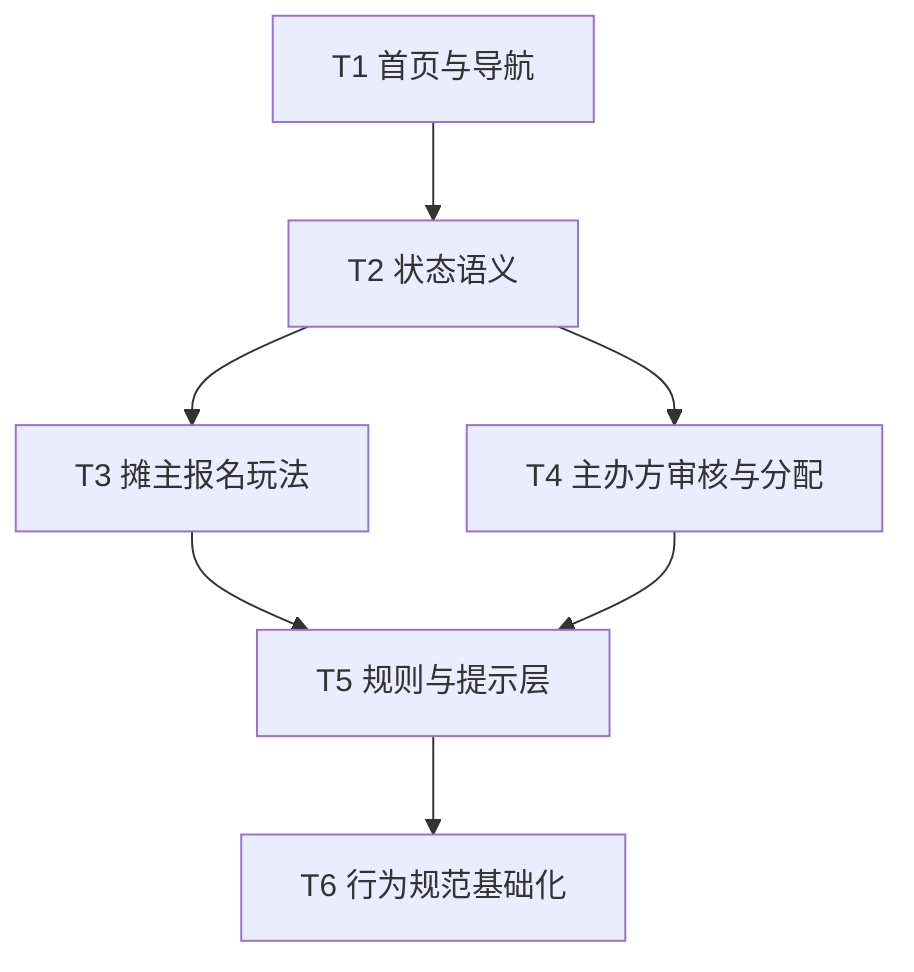

# TASK: 角色玩法升级

## 1. 文档信息

- 项目名称：市集招募平台
- 文档阶段：Atomize
- 文档日期：2026-05-03
- 功能主题：摊主与主办方双角色玩法升级
- 目标：把角色玩法设计拆成可独立执行、可验证、可审批的原子任务

## 2. 拆解原则

- 每个任务只处理一个清晰目标
- 页面任务与规则任务分离
- 优先先改“关键入口页”和“核心状态语义”
- 先做看得见的成交闭环，再做增强机制

## 3. 原子任务列表

### T1：重构双角色导航与首页入口

#### T1-1 摊主端首页信息层级重排

- 输入契约
  - 现有摊主首页、市场列表、我的报名入口
- 输出契约
  - 摊主首页优先展示机会、待办和进度
- 实现约束
  - 不改变认证和路由模型
  - 移动端优先
- 依赖
  - 无
- 验收标准
  - 首页首屏能直接看到机会卡、待处理事项和报名进度

#### T1-2 主办方端首页改为招商控制台

- 输入契约
  - 现有主办方市集页、申请数据、审核数据
- 输出契约
  - 首页优先展示待审核、确认率、风险提醒和空位风险
- 实现约束
  - 桌面端优先
  - 不引入新领域实体
- 依赖
  - 无
- 验收标准
  - 首页首屏可见待处理量和风险块，而不是纯导航页

### T2：统一角色语义和页面文案

#### T2-1 摊主视角状态文案改造

- 输入契约
  - 现有报名状态枚举和页面展示位置
- 输出契约
  - 所有摊主状态文案面向“我下一步要做什么”
- 实现约束
  - 不新增状态枚举，只改展示语义和说明
- 依赖
  - T1-1
- 验收标准
  - 摊主能在任意状态下看懂当前进度和下一步动作

#### T2-2 主办方视角状态文案改造

- 输入契约
  - 现有市集状态、申请状态、审核流程
- 输出契约
  - 所有主办方状态文案面向“待处理库存和风险控制”
- 实现约束
  - 与摊主端语义可不同，但事实必须一致
- 依赖
  - T1-2
- 验收标准
  - 主办方在工作台中能清楚知道哪些对象需要优先处理

### T3：重构摊主端报名玩法

#### T3-1 市集卡片决策信息前置

- 输入契约
  - 现有市集列表卡片和详情摘要
- 输出契约
  - 卡片优先展示时间、地点、费用、品类、主办方信誉、审核周期
- 实现约束
  - 不增加长文案负担
- 依赖
  - T1-1
- 验收标准
  - 用户无需点进详情页也能完成初步报名判断

#### T3-2 报名表单拆成通用资料和本场补充

- 输入契约
  - 现有申请表单、用户资料、附件数据
- 输出契约
  - 复用通用资料，单场仅补差异字段
- 实现约束
  - 不破坏现有申请提交 API
- 依赖
  - T3-1
- 验收标准
  - 二次报名时重复填写显著减少

#### T3-3 我的报名页改成状态任务流

- 输入契约
  - 现有报名列表页和状态数据
- 输出契约
  - 列表按待处理优先级和状态分组展示
- 实现约束
  - 优先支持待补件、待确认、候补、已录取等关键状态
- 依赖
  - T2-1
- 验收标准
  - 用户能快速看到最需要处理的报名记录

### T4：重构主办方端审核与分配玩法

#### T4-1 申请池支持优先级排序

- 输入契约
  - 现有申请列表、摊主资料、履约信息
- 输出契约
  - 支持按匹配度、完整度、历史表现排序
- 实现约束
  - MVP 阶段可以先用规则排序，不强求智能推荐
- 依赖
  - T1-2
- 验收标准
  - 主办方能先处理最值得优先看的报名

#### T4-2 审核动作结构化

- 输入契约
  - 现有审核通过/拒绝逻辑
- 输出契约
  - 增加候补、补件、结构化拒绝原因和结构化补件原因
- 实现约束
  - 原有状态流转保持兼容
- 依赖
  - T2-2
- 验收标准
  - 审核页面支持标准化动作，不依赖自由文本

#### T4-3 摊位分配页补强冲突与空位视图

- 输入契约
  - 现有摊位、申请、分配结果数据
- 输出契约
  - 可见未分配、冲突、候补补位入口
- 实现约束
  - 不强行引入地图系统
- 依赖
  - T4-2
- 验收标准
  - 主办方能识别空位和冲突，不只看静态列表

### T5：规则与提示层产品化

#### T5-1 摊主端时限与风险提示

- 输入契约
  - 报名截止、补件截止、确认截止等时限字段
- 输出契约
  - 摊主端显式显示时限和过期后果
- 实现约束
  - 优先前端提示，必要时补服务端兜底
- 依赖
  - T3-3
- 验收标准
  - 用户能明确知道不处理会发生什么

#### T5-2 主办方端催办与风险提示

- 输入契约
  - 待审核数量、超时数量、待确认数量
- 输出契约
  - 工作台有明显风险提醒
- 实现约束
  - 可先基于现有数据做规则提醒
- 依赖
  - T1-2
- 验收标准
  - 主办方能直接看到超时和成场风险

#### T5-3 关键动作日志与留痕增强

- 输入契约
  - 审核、角色切换、登录注册等关键动作
- 输出契约
  - 统一结构化日志与操作留痕
- 实现约束
  - 复用现有 logger
- 依赖
  - 无
- 验收标准
  - 关键状态流转和敏感动作可追踪

### T6：行为规范与信誉机制基础化

#### T6-1 摊主端好行为提示与风险说明

- 输入契约
  - 资料完整度、Passkey、安全提示、履约相关信息
- 输出契约
  - 页面显式提示什么行为更有利于被录取
- 实现约束
  - 先做提示，不先做复杂评分
- 依赖
  - T5-1
- 验收标准
  - 摊主能理解什么是高质量报名

#### T6-2 主办方端时效与透明度提示

- 输入契约
  - 审核时间、补件时间、通知时间
- 输出契约
  - 页面显式提示规则、透明度和处理时效要求
- 实现约束
  - 不强制引入平台处罚系统
- 依赖
  - T5-2
- 验收标准
  - 主办方知道平台认为什么是高质量运营行为

## 4. 推荐实施顺序

1. T1 双角色首页和导航
2. T2 状态语义统一
3. T3 摊主报名玩法重构
4. T4 主办方审核与分配重构
5. T5 规则与提示层产品化
6. T6 行为规范与信誉机制基础化

## 5. 依赖关系

## 6. 验收要求

- 每个任务都必须补对应页面或逻辑回归测试
- 不得破坏现有认证、角色切换和核心业务路径
- 所有新文案必须体现角色差异，不允许只做皮肤级改造
- 页面改造后必须能直接看出摊主端和主办方端的产品目标差异
