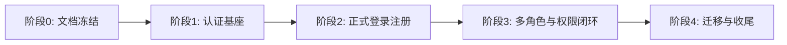
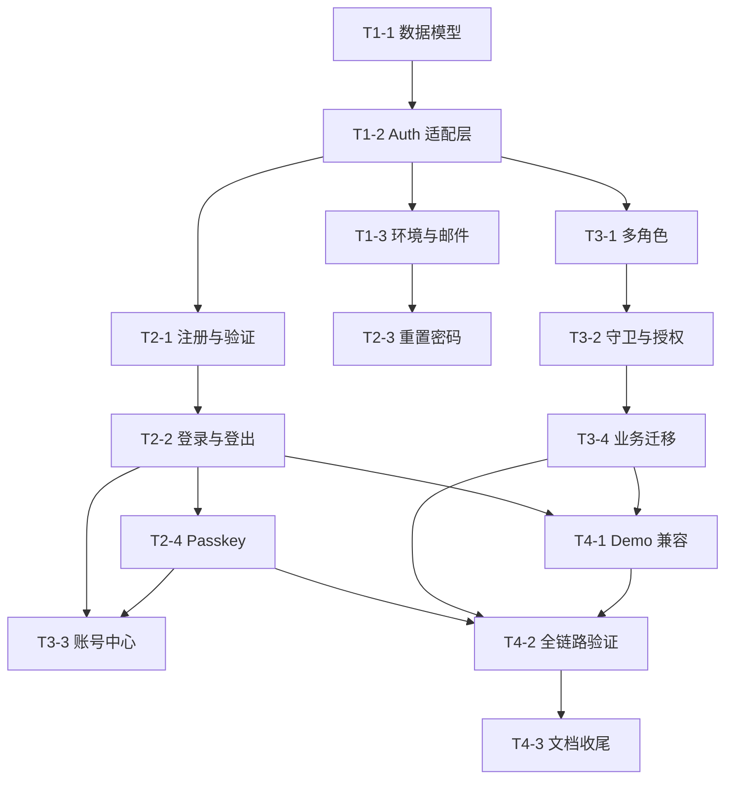

# TASK: 认证升级

## 1. 文档信息

- 项目名称：市集招募平台
- 文档阶段：Atomize
- 文档日期：2026-05-03
- 目标：将认证升级设计拆分为可独立执行、可验证、可审批的原子任务

## 2. 拆解原则

- 每个任务只覆盖 1 个明确的认证切片
- 每个任务都必须先补测试，再改实现
- 高风险数据迁移任务必须可回滚
- 角色与权限任务必须包含匿名访问和越权回归用例
- UI 任务不得绕开服务端鉴权边界

## 3. 阶段总览

## 4. 任务地图

- `E1`：认证基座与数据模型
- `E2`：登录注册与恢复流程
- `E3`：多角色与路由保护
- `E4`：兼容迁移与验收

## 5. 原子任务清单

### T1-1 设计认证数据模型与迁移脚本

- 输入契约：认证设计文档、现有 Prisma schema
- 输出契约：`User` 新字段、`Account`、`Session`、`Verification`、`PasskeyCredential`、`UserRoleMembership` 等模型与迁移草案
- 实现约束：不得破坏现有业务表的 `userId` 主外键语义
- 依赖：无
- 验收标准：Prisma schema 通过校验；迁移方案含回滚说明；旧 `User.role` 的替代路径明确
- 级别：C

### T1-2 建立 Better Auth 与 Prisma 适配层

- 输入契约：认证模型、环境变量清单
- 输出契约：认证配置、Prisma adapter、服务端 auth client、基础 session helper
- 实现约束：生产环境禁用弱默认密钥；禁止保留当前自签 JWT 作为正式主会话
- 依赖：T1-1
- 验收标准：本地可创建/读取数据库会话；核心 helper 有单测
- 级别：B

### T1-3 补齐认证环境变量与邮件基础设施模板

- 输入契约：邮件验证、重置密码、Passkey 域名配置要求
- 输出契约：`.env.example`、配置加载模块、事务邮件适配接口
- 实现约束：禁止硬编码密钥；开发环境与生产环境配置分离
- 依赖：T1-2
- 验收标准：缺失关键配置时应用给出明确启动错误；邮件发送接口可被测试替身替换
- 级别：B

### T2-1 实现邮箱注册与验证流程

- 输入契约：注册字段、公开角色范围、验证邮件模板
- 输出契约：注册页、注册 action/API、验证页、验证 token 消费逻辑
- 实现约束：仅允许 `vendor`、`organizer` 公开注册；管理员不可公开注册
- 依赖：T1-2, T1-3
- 验收标准：注册后生成待验证账号；邮箱验证成功后自动建立会话或进入首登状态
- 级别：B

### T2-2 实现邮箱密码登录与登出

- 输入契约：登录表单、错误状态、回跳逻辑
- 输出契约：正式登录页、登录 action/API、登出逻辑、错误态映射
- 实现约束：移除正式入口中的演示账号输入；保留环境开关控制 demo 登录兼容入口
- 依赖：T1-2, T2-1
- 验收标准：密码正确可登录；密码错误或未验证邮箱显示正确错误；`returnTo` 生效
- 级别：B

### T2-3 实现忘记密码与重置密码

- 输入契约：找回密码表单、重置 token 生命周期
- 输出契约：忘记密码页、重置密码页、邮件触达逻辑、旧会话处理策略
- 实现约束：token 一次性、短时有效；不得泄露邮箱是否存在的敏感差异
- 依赖：T1-3, T2-1
- 验收标准：可完成完整重置链路；过期 token 返回明确提示
- 级别：B

### T2-4 实现 Passkey 绑定与登录

- 输入契约：WebAuthn 注册/断言流程、浏览器支持策略
- 输出契约：Passkey 创建、列表、删除、Passkey 登录入口
- 实现约束：不支持浏览器时要优雅回退；不得影响密码登录可用性
- 依赖：T1-2, T2-2
- 验收标准：已登录用户可绑定 Passkey；回访用户可仅用 Passkey 登录
- 级别：C

### T3-1 引入多角色成员关系与 active role 机制

- 输入契约：单账号多角色设计、现有 `vendor/organizer/admin` 规则
- 输出契约：角色成员关系模型、角色切换接口、session activeRole 支持
- 实现约束：业务资源归属继续使用统一 `userId`
- 依赖：T1-1, T1-2
- 验收标准：同一账号可同时拥有多个角色；切换后导航和落地页正确变化
- 级别：C

### T3-2 重构路由守卫与服务端授权入口

- 输入契约：公开/受限路由矩阵、ISSUE-006 缺陷记录
- 输出契约：新 middleware、通用 server guard、API guard helper
- 实现约束：匿名访问受限路由必须阻断；不得再信任 query/body 注入身份
- 依赖：T1-2, T3-1
- 验收标准：匿名访问 `/organizer/**` 被重定向；越权角色访问返回 `403`；现有业务 API 回归通过
- 级别：C

### T3-3 实现账号中心与角色开通入口

- 输入契约：账号中心信息架构、第二角色开通流程
- 输出契约：账号中心页面、角色切换 UI、角色开通 action、Passkey 管理入口
- 实现约束：不允许用户自助创建管理员角色
- 依赖：T2-2, T2-4, T3-1
- 验收标准：用户可查看当前角色、切换角色、开通第二角色、管理 Passkey
- 级别：B

### T3-4 迁移现有业务页面和 API 到新认证上下文

- 输入契约：现有登录页、middleware、role helper、业务 API 列表
- 输出契约：登录页替换、业务页 `getSessionUser()` 升级、新 guard 接入、旧 `User.role` 依赖清单收口
- 实现约束：分批替换，保持每批可回归验证
- 依赖：T2-2, T3-2
- 验收标准：关键业务路径在新认证下可正常工作；旧演示登录仅在显式开关下可见
- 级别：C

### T4-1 设计并执行演示账号兼容迁移

- 输入契约：seed 数据、开发环境需求、旧 demo alias 逻辑
- 输出契约：兼容开关、迁移脚本、开发文档
- 实现约束：生产默认关闭 demo 登录；不能让 demo 入口污染正式注册体验
- 依赖：T2-2, T3-4
- 验收标准：开发环境仍可快速初始化演示账号；生产配置下不存在 demo 登录主入口
- 级别：B

### T4-2 补齐认证全链路测试与浏览器验收

- 输入契约：前述任务输出、关键业务场景
- 输出契约：单元测试、集成测试、页面测试、浏览器验收记录
- 实现约束：必须覆盖 ISSUE-006 回归；必须覆盖注册、验证、登录、Passkey、重置密码、多角色切换
- 依赖：T2-4, T3-4, T4-1
- 验收标准：`lint`、`test`、`build` 全绿；浏览器实测通过关键认证路径
- 级别：B

### T4-3 文档与交付收尾

- 输入契约：实现结果、测试结果、遗留问题
- 输出契约：`ACCEPTANCE_认证升级.md`、`TODO_认证升级.md`、环境说明与运维提示
- 实现约束：只记录真实遗留项，不写占位结论
- 依赖：T4-2
- 验收标准：验收文档与代码状态一致；待办项可支持下一轮继续开发
- 级别：A

## 6. 依赖关系图

## 7. 执行门禁

- `T1-1`、`T2-4`、`T3-1`、`T3-2`、`T3-4` 属于高风险任务，执行前后都要显式回归
- 任何涉及 Prisma schema 变更的任务，都必须先生成迁移方案和回滚边界
- 任何涉及路由守卫的任务，都必须包含匿名访问与越权访问测试
- 未经审批，不得跳过测试先直接替换正式登录入口

## 8. 原子化验收结论

当以下条件满足时，Atomize 阶段视为通过：

1. 所有任务具备明确输入、输出、约束、依赖和验收标准
2. 任务依赖图无循环
3. 高风险任务均已标出审批与回滚要求
4. 可以基于本文档直接生成 Implementation Plan 并进入 Automate 阶段
