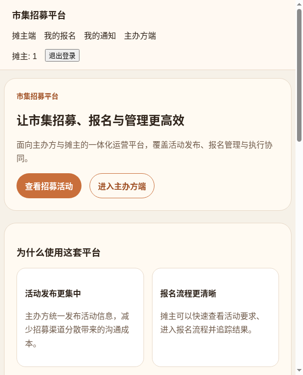
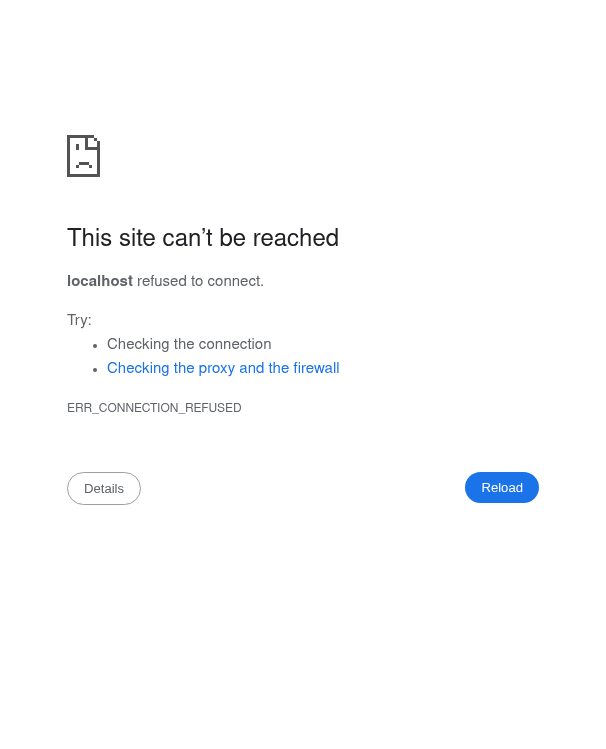
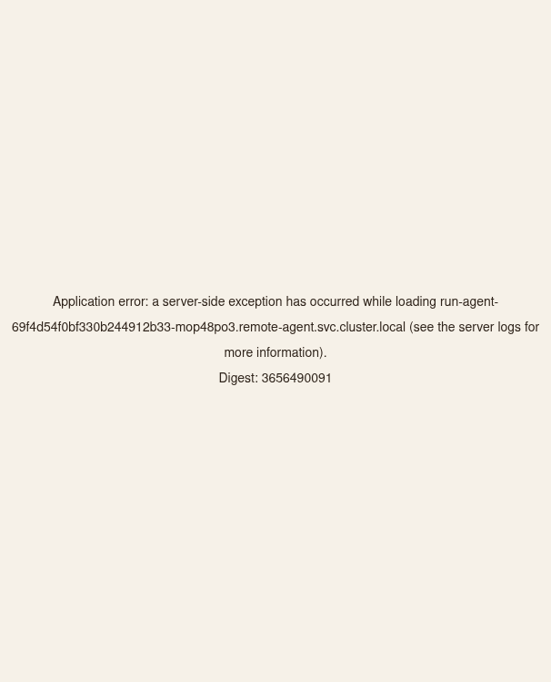
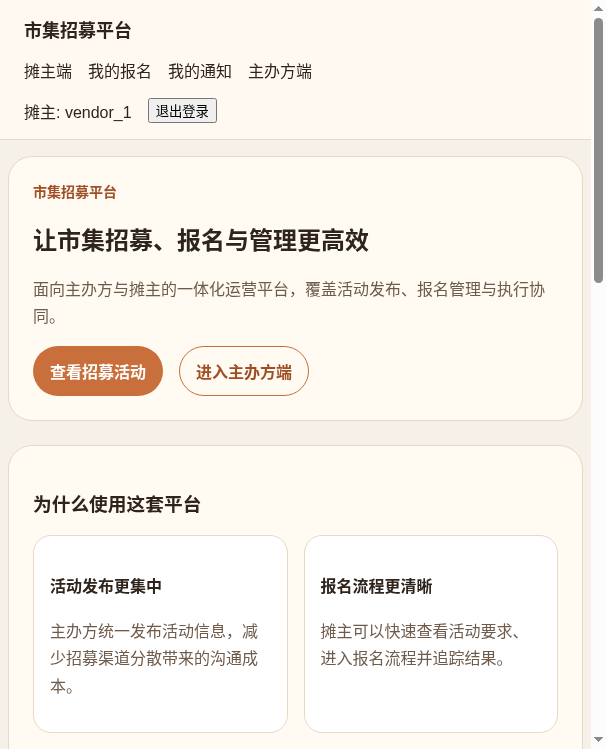

# Dogfood Report: 市集招募平台

| Field | Value |
|-------|-------|
| **Date** | 2026-05-03 |
| **App URL** | http://127.0.0.1:3002 |
| **Session** | market-platform-qa |
| **Scope** | 首页、登录、摊主端、主办方端、后台管理核心流程巡检 |

## Summary

| Severity | Count |
|----------|-------|
| Critical | 0 |
| High | 1 |
| Medium | 0 |
| Low | 0 |
| **Total** | **1** |

## Verification Update

- Re-verified on `http://127.0.0.1:3004` with the latest production build.
- Re-verified on `http://127.0.0.1:3006` after disabling unauthorized organizer-link prefetch on the homepage and shared shell.
- Fixed: `ISSUE-001` homepage organizer prefetch no longer emits `Failed to fetch RSC payload for /organizer/markets` during idle load.
- Fixed: `ISSUE-002` host rewrite to `localhost`.
- Fixed: `ISSUE-003` `/markets` no longer crashes when market data lookup fails; page now renders a recoverable alert.
- Fixed: `ISSUE-004` login page no longer exposes `Stub` copy.
- Fixed: `ISSUE-005` forged login no longer creates a session; in the current sandbox, unreachable DB now degrades to `service_unavailable` instead of a server error page.

## Issues

### ISSUE-006: 未登录访客可直接进入主办方工作台并看到创建市集表单

| Field | Value |
|-------|-------|
| **Severity** | high |
| **Category** | security |
| **URL** | http://127.0.0.1:3008/organizer/markets |
| **Repro Video** | N/A |

**Description**

在未登录状态下，直接访问主办方工作台地址 `/organizer/markets`，页面不会跳转到登录页，也不会显示“请先登录”的明确阻断，而是直接渲染“我的市集”页面和完整的“创建草稿”表单。进一步抽查 `/organizer/stalls` 也能直接打开“摊位管理”页面，说明这不是单页问题，而是主办方工作区整体缺少匿名访问保护。

**Evidence**

- Screenshot: [issue-006.png](file:///workspace/dogfood-output/screenshots/issue-006.png)

**Repro Steps**

1. 保持未登录状态，打开 `http://127.0.0.1:3008/organizer/markets`。
2. 观察页面直接显示“我的市集”标题，以及“市集标题 / 城市 / 创建草稿”等主办方表单控件。
3. 预期行为应为跳转到登录页或显示明确的未授权提示，而不是渲染后台工作台。

### ISSUE-001: 首页空闲状态触发主办方页 RSC 预取失败

| Field | Value |
|-------|-------|
| **Severity** | medium |
| **Category** | console |
| **URL** | http://127.0.0.1:3002/ |
| **Repro Video** | N/A |

**Description**

首页加载完成后，即使用户没有点击任何内容，浏览器控制台也会稳定出现 `Failed to fetch RSC payload for /organizer/markets` 错误，网络面板里对应的 `GET /organizer/markets?_rsc=...` 请求状态为失败。页面最终会回退到普通浏览器导航，但这说明首页的主办方入口预取链路已损坏，会制造控制台噪音，并可能在弱网环境下放大导航抖动。

**Repro Steps**

1. 打开首页 `http://127.0.0.1:3002/`
   

2. 不做任何点击，等待首页静置完成。
   

3. **观察：** 控制台稳定出现 `Failed to fetch RSC payload for http://127.0.0.1:3002/organizer/markets`，网络请求 `GET /organizer/markets?_rsc=...` 失败。

---

### ISSUE-002: 首页“主办方端”入口会把当前主机强制切成 localhost 导致页面不可达

| Field | Value |
|-------|-------|
| **Severity** | high |
| **Category** | functional |
| **URL** | http://127.0.0.1:3002/ |
| **Repro Video** | N/A |

**Description**

在首页已登录态点击顶部导航里的“主办方端”后，页面不是继续留在当前主机 `127.0.0.1:3002` 下跳到主办方页，而是直接把地址改写成 `http://localhost:3002/`。在当前部署/预览环境里，这会立即落到浏览器错误页，主办方入口等同于不可用。

**Repro Steps**

1. 打开首页 `http://127.0.0.1:3002/`。
   

2. 点击顶部导航中的“主办方端”。
   

3. **观察：** 地址栏切换为 `http://localhost:3002/`，页面显示 `This site can’t be reached`。

---

### ISSUE-003: 点击“摊主端”后直接进入服务器异常页，市集浏览主流程被阻断

| Field | Value |
|-------|-------|
| **Severity** | critical |
| **Category** | functional |
| **URL** | http://127.0.0.1:3002/markets |
| **Repro Video** | N/A |

**Description**

从首页点击“摊主端”会进入 `/markets`，但页面没有展示招募活动列表，而是直接出现 Next.js 生产错误页：`Application error: a server-side exception has occurred while loading...`。这会直接阻断摊主浏览市集和后续报名，是核心主路径不可用。

**Repro Steps**

1. 打开首页 `http://127.0.0.1:3002/`。
   

2. 点击顶部导航中的“摊主端”。
   

3. **观察：** 页面跳到 `/markets` 后直接显示服务器异常页，控制台同时出现 `An error occurred in the Server Components render`。

---

### ISSUE-004: 登录页仍暴露占位文案“登录 (Stub)”

| Field | Value |
|-------|-------|
| **Severity** | low |
| **Category** | content |
| **URL** | http://127.0.0.1:3002/login |
| **Repro Video** | N/A |

**Description**

登录页主标题直接显示“登录 (Stub)”，这属于开发占位文案泄漏到真实界面。虽然不阻断功能，但会削弱产品完成度，并让用户误以为这是未完成页面。

**Repro Steps**

1. 访问 `http://127.0.0.1:3002/login`。
   

2. **观察：** 页面标题包含 `Stub` 字样。

---

### ISSUE-005: 登录表单会接受不存在的用户 ID，匿名用户可直接伪造会话

| Field | Value |
|-------|-------|
| **Severity** | high |
| **Category** | functional |
| **URL** | http://127.0.0.1:3002/login |
| **Repro Video** | N/A |

**Description**

在登录页保持默认“摊主”角色，输入明显不存在的 `userId`（如 `nonexistent_vendor`）后提交，系统不会报错或拒绝，而是直接把用户带回首页，并显示已登录态导航（出现“我的报名”“我的通知”“退出登录”）。这意味着当前登录表单没有校验用户是否真实存在，匿名访问者可以伪造任意会话。

**Repro Steps**

1. 访问 `http://127.0.0.1:3002/login`。
   

2. 在“用户 ID”中输入 `nonexistent_vendor`，点击“登录”。
   

3. **观察：** 页面返回首页并显示已登录态导航，而不是提示用户不存在或登录失败。

---
